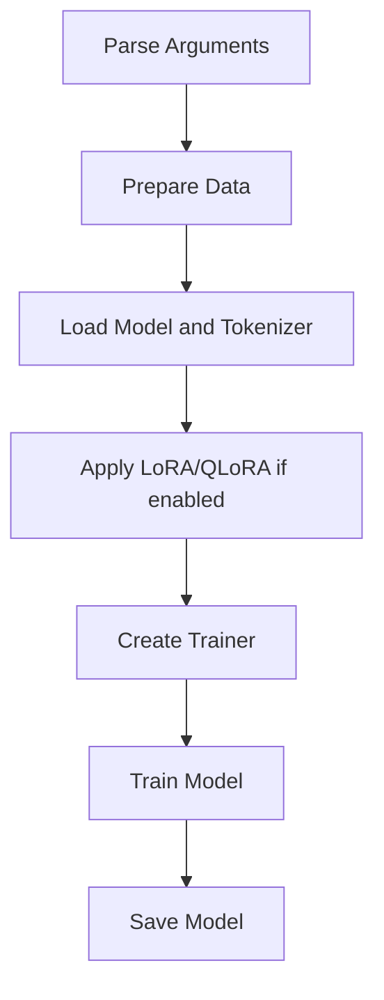
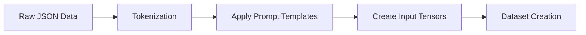
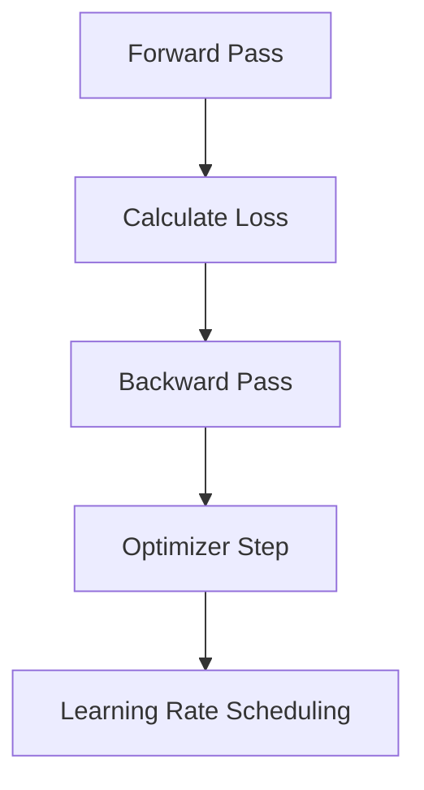
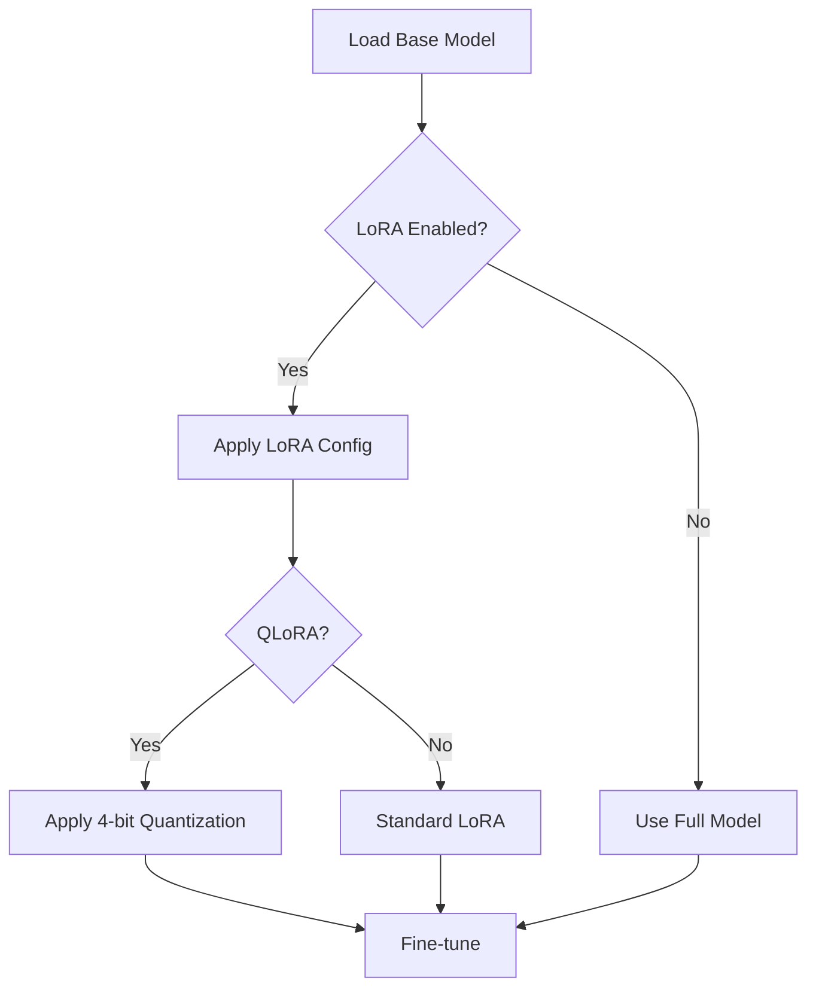

# Qwen Model Fine-tuning Script Explanation

This document provides a detailed explanation of the training script for fine-tuning the Qwen language model. The script is based on the revised code from FastChat, which in turn is based on the Stanford Alpaca project.

## Table of Contents

1. [Overview](#overview)
2. [Key Components](#key-components)
3. [Data Processing](#data-processing)
4. [Model Preparation](#model-preparation)
5. [Training Process](#training-process)
6. [LoRA and QLoRA](#lora-and-qlora)
7. [Saving the Model](#saving-the-model)

## Overview

The script is designed to fine-tune the Qwen language model using supervised learning. It supports various configurations, including the use of LoRA (Low-Rank Adaptation) and QLoRA (Quantized LoRA) for efficient fine-tuning.

Here's a high-level flowchart of the training process:

## Key Components

The script defines several key components:

1. **ModelArguments**: Specifies the model architecture.
2. **DataArguments**: Defines data-related parameters.
3. **TrainingArguments**: Sets training process parameters.
4. **LoraArguments**: Configures LoRA-specific settings.
5. **SupervisedDataset** and **LazySupervisedDataset**: Handle data preprocessing and loading.
6. **Trainer**: Manages the training process.

## Data Processing

The data processing pipeline involves the following steps:

1. Load raw data from JSON files.
2. Tokenize and format the conversations.
3. Apply prompt templates to structure the input.
4. Create input tensors for model training.

Here's a visualization of the data processing flow:

## Model Preparation

The script prepares the model for fine-tuning through these steps:

1. Load the pre-trained Qwen model and tokenizer.
2. Configure the model (e.g., disabling caching, setting RoPE scaling factor).
3. Apply LoRA or QLoRA if enabled.
4. Prepare the model for distributed training if necessary.

## Training Process

The training process is managed by the Hugging Face `Trainer` class. Key aspects include:

- Gradient accumulation and checkpointing for efficient training.
- Support for distributed training (DeepSpeed, FSDP).
- Optional use of mixed-precision training (FP16 or BF16).

Here's a simplified view of a single training step:

## LoRA and QLoRA

The script supports both LoRA and QLoRA for efficient fine-tuning:

- **LoRA**: Adds low-rank adaptation matrices to certain layers of the model.
- **QLoRA**: Combines LoRA with 4-bit quantization for even more efficient fine-tuning.

When enabled, LoRA or QLoRA is applied after loading the base model:

## Saving the Model

After training, the model is saved using a custom `safe_save_model_for_hf_trainer` function. This function handles:

- Collecting the state dictionary, considering DeepSpeed Zero3 if enabled.
- Saving only the LoRA weights if LoRA was used.
- Ensuring proper saving in distributed training environments.

---

This document provides an overview of the key components and processes in the Qwen model fine-tuning script. For more detailed information on specific aspects, please refer to the original script or ask for clarification on particular sections.